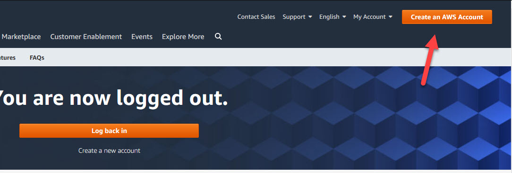
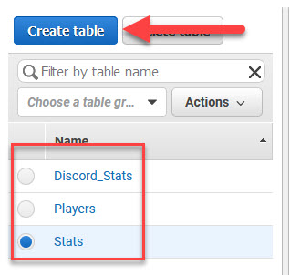

## Configuring AWS

* Go to the [AWS Console](https://aws.amazon.com/console/) and click "Create an Account"
    * 
* Fill out the required details and get your credentials
* Navigate to DynamoDB in the database section
    * Create the following tables:
        * **Discord_Stats** - Primary key: DiscordID (String)
        * **Players** - Primary key: DiscordID (String)
        * **Stats** - Primary key: SteamID64 (String)
        * 
* Download and install [AWS CLI](https://aws.amazon.com/cli/).
* After it is installed open PowerShell and run `aws configure`
    * Enter in your access key, secret key, and region.
* Enjoy that sweet, sweet database life.
